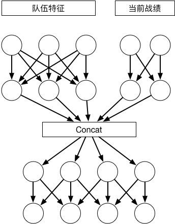
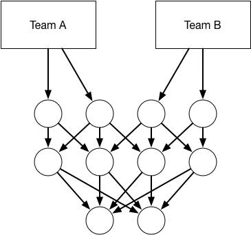

# Basketball Prediction

## Introduction

> Predict the probability of the basketball matches with Deep Neural Networks
> 2017 Seedcup Preliminary Contest

#### Team Representation Network

#### Competition Network

## Environment

* Pytorch
* XGBoost
* Scikit-Learn

## Licence

**This Project is Under the MIT Licence**

